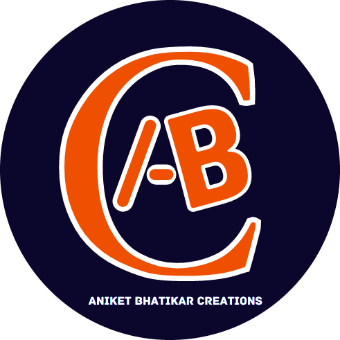

# Aniket Bhatikar Creations - Official Website



Welcome to the official website of **Aniket Bhatikar Creations**! This website showcases blogs, tutorials, and various projects by Aniket Bhatikar.

## 📌 Features

- 🏠 **Home Page**: Overview of ABC and its mission.
- 👤 **About Page**: Information about Aniket Bhatikar.
- ✍️ **Blogs**: Articles and experiences shared by Aniket.
- 📰 **ABC's News Nook**: Featured mentions and publications.
- 💬 **Comment Section**: Powered by Utterances, allowing GitHub users to engage in discussions.
- 🔗 **Social Media Links**: Connect with ABC on YouTube, LinkedIn, and GitHub.

## 🛠️ Technologies Used

- **HTML, CSS, JavaScript**: Frontend development
- **Utterances**: GitHub-powered comment system
- **GitHub Pages**: Hosting the website

## 🌐 Live Website

🚀 You can visit the website here: **[Aniket Bhatikar Creations](https://aniketbhatikarcreations.github.io/)**

## 🚀 How to Contribute

1. 🍴 Fork the repository
2. 📥 Clone the forked repo:
   ```bash
   git clone https://github.com/<your-github-username>/aniketbhatikarcreations.github.io
   ```
3. 🛠️ Make changes and test locally
4. 🔄 Submit a pull request

## 📊 Website Views


## 📝 License

ABC's website is licensed under a **[Creative Commons Attribution-NoDerivatives 4.0 International License](https://creativecommons.org/licenses/by-nd/4.0/)**.

---

For any inquiries, contact via GitHub or social media links available on the website!

📩 Or drop your query at **aniketbhatikar11@gmail.com**.

Thank You for visiting!


